# Do Fundamentals Matter? Testing Whether Financial Quality Predicts Stock Performance in the S&P 500
 
## ✅ Data Pipeline
 
- [x] Financial Data
- [x] Price Data (daily adjusted close)
- [x] S&P 500 Historical Components
 
---
 
## Quality Score Calculation
 
### Profitability
- [x] GPOA
- [x] ROE
- [x] ROA
- [x] GMAR
- [x] ACC
- [ ] CFOA (coming soon)
 
**Status: 5/6 (CFOA not implementing)**
 
### Safety
- [x] LEV (Leverage)
- [x] EVOL (Stability)
- [ ] BAB (Beta)
- [ ] O-Score (Ohlson) (coming soon)
- [ ] Z-Score (Altman) (coming soon)
 
**Status: 2/5 (BAB, O-Score, Z-Score not implementing)**
 
### Growth
- [x] ΔGPOA
- [x] ΔROE
- [x] ΔROA
- [x] ΔGMAR
- [ ] ΔCFOA (coming soon)
 
**Status: 4/5 (ΔCFOA not implementing)**


##  Backtesting Framework
 
### Core Backtesting Engine
 
- [x] Portfolio Construction & Rebalancing
- [x] Return & NAV Calculation
- [x] Trading Fees & Slippage
 
---
 
### ✅ Risk Metrics
 
- [x] CAGR, Volatility, Sharpe, Sortino, Calmar, MDD, Win Rate
 
---
 
### ✅ Strategy Implementations
 
- [x] Equal Weight
- [x] Rank-Based
- [x] Top3
- [x] Top3Rank
- [x] Top50
- [x] AbsMom (Absolute Momentum)
- [x] DualMom (Dual Momentum)
- [x] InvVol (Inverse Volatility)
- [x] AAA (All-Around Amazing)
 
---

### ✅ Hyperparameter Backtest
 
- [x] Support Multi Strategies
- [x] Support Multi Lookbacks
- [x] Support Multi Rebalances
- [ ] Robust optimization parameter stable
 
---


## Statistical Testing

- [ ] t-test: Quality vs Junk per component (Score_Profit, Score_Safety, Score_Growth, QMJ_Score)
- [ ] Bootstrap Confidence Interval ของ Q−J Spread
- [ ] p-value summary table per component
- [ ] Effect size (Cohen's d)

--- 

## Future Improvements

- [x] Extend universe to S&P 500 (US)
- [ ] Extend universe to CSI 300 / SSE 50 (China)
- [ ] Extend universe to DAX 40 (Germany)
- [ ] Extend universe to SET50 / SET100 (Thailand)

---
 
## Introduction

ปัจจัยพื้นฐานยังคงเป็นกุญแจสำคัญในการสร้างผลตอบแทนจริงหรือไม่? การค้นหาคำตอบนี้ได้รับแรงบันดาลใจจาก Asness, Frazzini, and Pedersen (2019) ซึ่งเสนอกรอบแนวคิด Quality Minus Junk (QMJ) โดยนิยาม "คุณภาพ" ของบริษัทผ่าน 3 มิติหลัก ได้แก่ Profitability, Safety และ Growth และพบว่าหุ้นคุณภาพสูงสามารถสร้างผลตอบแทนที่เหนือกว่าตลาดได้อย่างมีนัยสำคัญในระยะยาว

จึงนำแนวคิดดังกล่าวมาทดสอบในบริบทของตลาดหุ้นสหรัฐฯ (S&P 500) โดยใช้ระบบการลงทุนเชิงปริมาณคัดกรองหุ้นด้วยข้อมูลงบการเงินย้อนหลัง พร้อมจำลองการลงทุน (Backtest) เพื่อประเมินว่า fundamental quality สามารถอธิบายและทำนายผลตอบแทนระยะยาวได้จริงหรือไม่

## Data Source

ชุดข้อมูลพื้นฐาน (Fundamental Data) ประกอบด้วยข้อมูลจากงบกำไรขาดทุน (Income Statement), งบแสดงฐานะการเงิน (Balance Sheet) และงบกระแสเงินสด (Cash Flow) ของบริษัทจดทะเบียนในสหรัฐอเมริกา (US Listed Companies) ควบคู่กับข้อมูลราคาหุ้นรายวัน (Daily Price Data) และข้อมูล S&P 500 Historical Components & Changes

| Dataset | Source |
|---------|--------|
| Financial Statements (Income Statement · Balance Sheet · Cash Flow) | [SimFin — US Companies](https://simfin.com/) |
| Share Prices (Daily Adjusted Close) | [SimFin — US Share Prices](https://simfin.com/) · [Yahoo Finance](https://finance.yahoo.com/) |
| S&P 500 Historical Components & Changes | [GitHub — fja05680/sp500](https://github.com/fja05680/sp500) |

## Data Filtering & Processing

เพื่อให้ผลการทดสอบปราศจากอคติจากการเลือกเฉพาะบริษัทที่รอดชีวิตมาจนถึงปัจจุบัน (Survivorship Bias) เราใช้ข้อมูล S&P 500 Historical Components & Changes เพื่อระบุรายชื่อสมาชิกดัชนีตามจริงในแต่ละช่วงเวลา (Point-in-Time) ซึ่งเป็นหัวใจสำคัญในการกำหนดขอบเขตหุ้นที่ใช้ทดสอบ (Investment Universe) ให้ถูกต้องตามเหตุการณ์ที่เกิดขึ้นจริงในอดีต โดยหุ้นแต่ละตัวจะถูกนำมาวิเคราะห์เฉพาะในช่วงเวลาที่มีสถานะเป็นสมาชิกของดัชนีเท่านั้น

ข้อมูลดิบทั้งหมดจะผ่านกระบวนการ Data Cleaning เพื่อกำจัด Outliers และจัดการกับ Missing Data ก่อนจะเข้าสู่ขั้นตอน Feature Engineering เพื่อคำนวณอัตราส่วนทางการเงินเชิงคุณภาพสำหรับกลยุทธ์ QMJ ต่อไป

## Quality Scoring Methodology

การลงทุนแบบ QMJ (Quality Minus Junk) อาศัยการประเมินมูลค่าหุ้นตามทฤษฎีที่ว่า หุ้นที่มีมูลค่าสูงคือหุ้นที่ทำกำไรได้ดี มีความเสี่ยงต่ำ และมีการเติบโตอย่างต่อเนื่อง โดยมุ่งเน้นการใช้ข้อมูลจากงบการเงินเพื่อคำนวณหา "คุณภาพ (Quality)" ที่แท้จริงของบริษัทผ่านตัวเลขทางบัญชี เพื่อให้สามารถเปรียบเทียบคุณภาพของหุ้นที่มีขนาดธุรกิจและอุตสาหกรรมที่แตกต่างกันได้อย่างครอบคลุม เราจึงแบ่งมิติการวัดผลออกเป็น 3 เสาหลัก (Three Pillars of Quality) ดังนี้:

### Profitability (ความสามารถในการทำกำไร)

คะแนนส่วนนี้ใช้วัดความสามารถของบริษัทในการสร้างผลกำไรจากสินทรัพย์และส่วนของผู้ถือหุ้นที่มีอยู่ บริษัทที่มีคุณภาพจะต้องมีอัตรากำไรที่สูงสม่ำเสมอ และที่สำคัญคือผลกำไรนั้นควรมาจาก "เงินสด" จริง ไม่ใช่เพียงตัวเลขทางบัญชีที่เกิดจากรายการค้างรับค้างจ่าย (Accruals)

**วิธีการคำนวณ:** 
นำอัตราส่วนทางการเงินด้านล่างนี้มาแปลงเป็นค่ามาตรฐาน (Z-Score) แล้วหาค่าเฉลี่ย:

$$\text{Profitability} = z\left(\frac{1}{6}(z_{\text{GPOA}} + z_{\text{ROE}} + z_{\text{ROA}} + z_{\text{CFOA}} + z_{\text{GMAR}} + z_{\text{ACC}})\right)$$

| ตัวชี้วัด | สูตร | ความหมาย |
|----------|------|---------|
| **GPOA** | $\frac{\text{Revenue} - \text{COGS}}{\text{Total Assets}}$ | กำไรขั้นต้น / สินทรัพย์รวม เพื่อวัดประสิทธิภาพการใช้สินทรัพย์ในการสร้างกำไร |
| **ROE** | $\frac{\text{Net Income}}{\text{Book Equity}}$ | กำไรสุทธิ / ส่วนของผู้ถือหุ้น เพื่อวัดผลตอบแทนต่อเงินทุนของเจ้าของ |
| **ROA** | $\frac{\text{Net Income}}{\text{Total Assets}}$ | กำไรสุทธิ / สินทรัพย์รวม เพื่อวัดผลตอบแทนต่อสินทรัพย์ทั้งหมดของบริษัท |
| **CFOA** | $\frac{\text{Operating Cash Flow}}{\text{Total Assets}}$ | **กระแสเงินสดจากปฏิบัติการ / สินทรัพย์รวม** เพื่อวัดว่าผลกำไรมาจากเงินสดจริงเท่าไหร่ |
| **GMAR** | $\frac{\text{Revenue} - \text{COGS}}{\text{Revenue}}$ | กำไรขั้นต้น / ยอดขาย เพื่อวัดอัตรากำไรขั้นต้นจากการดำเนินงาน |
| **ACC** | $\frac{\text{Depreciation} - \Delta \text{Working Capital}}{\text{Total Assets}}$ | (ค่าเสื่อมราคา - การเปลี่ยนแปลงเงินทุนหมุนเวียน) / สินทรัพย์รวม โดยค่านี้ยิ่งต่ำยิ่งดี เพราะสะท้อนว่ากำไรที่เกิดขึ้นมาจากกระแสเงินสดจริงเป็นหลัก |
 
<p align="center">
  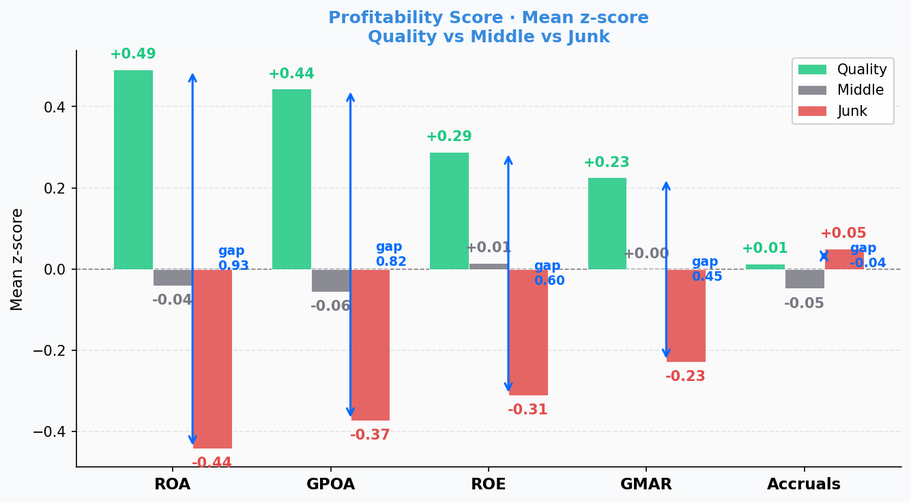
</p>
<p align="center">
  <b>Figure 1 :</b> ค่าเฉลี่ย z-score ของตัวชี้วัดด้าน Profitability (ROA, GPOA, ROE, GMAR และ Accruals) สำหรับกลุ่ม Quality, Middle และ Junk
</p>
<!--  -->
<!-- *Figure 1: ค่าเฉลี่ย z-score ของตัวชี้วัดด้าน Profitability (ROA, GPOA, ROE, GMAR และ Accruals) สำหรับกลุ่ม Quality, Middle และ Junk* -->

Quality portfolio มีความสามารถในการทำกำไรสูงกว่าอย่างมีนัยสำคัญในทุกตัวชี้วัดหลัก โดย ROA และ GPOA มีความแตกต่างเด่นชัดที่สุด ขณะที่ Accruals มีความสามารถในการแยกกลุ่มต่ำ สะท้อนว่าระดับของผลกำไรเป็นปัจจัยหลักในการกำหนดคุณภาพของบริษัทในโมเดลนี้

<p align="center">
  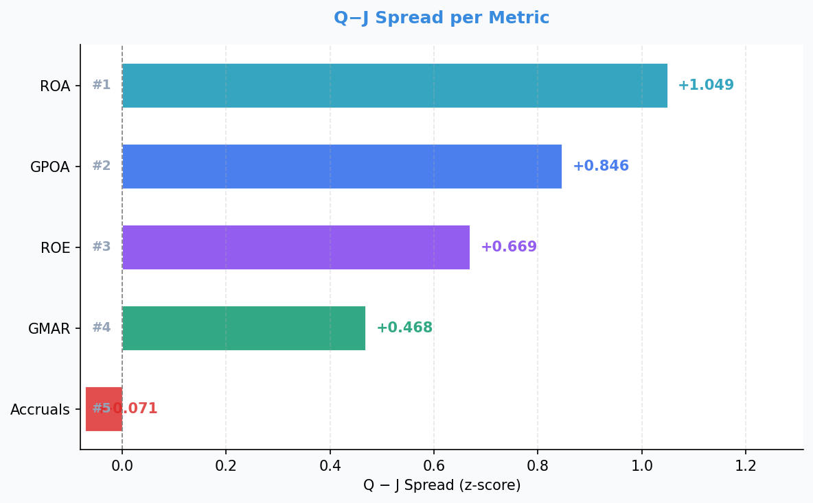
</p>
<p align="center">
  <b>Figure 2: </b>ค่า Q–J Spread (Quality − Junk) ของตัวชี้วัดด้าน Profitability แต่ละตัว (ROA, GPOA, ROE, GMAR และ Accruals)
</p>
<!-- 
*Figure 2: ค่า Q–J Spread (Quality − Junk) ของตัวชี้วัดด้าน Profitability แต่ละตัว (ROA, GPOA, ROE, GMAR และ Accruals)* -->

การจัดอันดับแสดงให้เห็นว่า ROA เป็นตัวแปรที่มีความสามารถในการแยกหุ้นคุณภาพสูงสุด รองลงมาคือ GPOA ซึ่งทั้งสองสะท้อนถึงประสิทธิภาพในการใช้สินทรัพย์เพื่อสร้างกำไร ขณะที่ Accruals มีค่าใกล้ศูนย์และไม่สามารถแยกกลุ่มได้อย่างชัดเจน จึงมีบทบาทรองเมื่อเทียบกับ profitability metrics


<p align="center">
  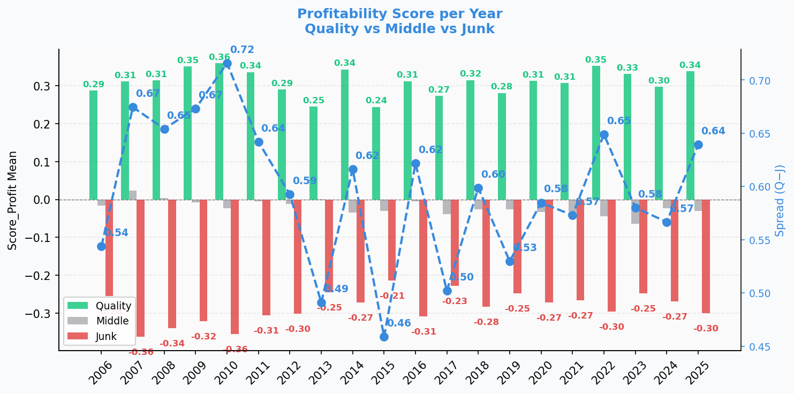
</p>
<p align="center">
  <b>Figure 3: </b>ค่าเฉลี่ย Profitability score ของกลุ่ม Quality, Middle และ Junk ในแต่ละปี พร้อม Q–J Spread
</p>

<!-- 
*Figure 3: ค่าเฉลี่ย Profitability score ของกลุ่ม Quality, Middle และ Junk ในแต่ละปี พร้อม Q–J Spread* -->

ผลลัพธ์สะท้อนว่า Profitability factor มีความสม่ำเสมอในเชิงเวลา โดย Quality portfolio มีระดับผลกำไรสูงกว่า Junk อย่างต่อเนื่องในทุกปี และ Q–J Spread ยังคงเป็นบวกตลอดช่วงเวลา แม้จะมีความผันผวนในบางช่วง เช่น 2012–2015 ที่ spread อ่อนตัวลง ซึ่งสะท้อนความผันผวนตามสภาวะตลาด อย่างไรก็ตาม แนวโน้มโดยรวมยังยืนยันว่าความสามารถในการทำกำไรเป็นสัญญาณหลักที่มีเสถียรภาพในการแยกหุ้นคุณภาพในระยะยาว

### Safety (ความปลอดภัยทางการเงิน)

คะแนนส่วนนี้ใช้วัดระดับ "ความเสี่ยง" ของบริษัท หุ้นที่มีคุณภาพสูงจะต้องมีความทนทานต่อสภาวะเศรษฐกิจตกต่ำ (Low Risk) มีภาระหนี้สินในระดับที่ควบคุมได้ และมีผลประกอบการในอดีตที่สม่ำเสมอ ไม่มีความผันผวนที่รุนแรงจนเกินไป

**วิธีการคำนวณ:** คำนวณจากการนำอัตราส่วนด้านล่างมาทำเป็นค่ามาตรฐาน (Z-Score) โดยปรับเกณฑ์ให้บริษัทที่มีความเสี่ยงต่ำได้รับคะแนนสูง:

$$\text{Safety} = z\left(\frac{1}{5}(z_{\text{BAB}} + z_{\text{LEV}} + z_{\text{O-Score}} + z_{\text{Z-Score}} + z_{\text{EVOL}})\right)$$

####  Ohlson O-Score
$$O = -1.32 - 0.407\log(TA) + 6.03\frac{TL}{TA} - 1.43\frac{WC}{TA} + 0.076\frac{CL}{CA} - 1.72X - 2.37\frac{NI}{TA} - 1.83\frac{FFO}{TL} + 0.285Y - 0.521\frac{\Delta NI}{|NI_t| + |NI_{t-1}|}$$
 
| ตัวแปร | ความหมาย |
|--------|----------|
| $TA$ | Total Assets |
| $TL$ | Total Liabilities |
| $WC$ | Working Capital |
| $CL$ | Current Liabilities |
| $CA$ | Current Assets |
| $NI$ | Net Income |
| $FFO$ | Funds From Operations (Net Income + Depreciation) |
| $X$ | 1 ถ้า TL > TA, มิฉะนั้น 0 |
| $Y$ | 1 ถ้าขาดทุน 2 ปีติดกัน, มิฉะนั้น 0 |

```
O > 0.5  → มีความเสี่ยงล้มละลายสูง
O < 0.5  → มีความเสี่ยงล้มละลายต่ำ
```
> Ohlson, J. A. (1980). Financial Ratios and the Probabilistic Prediction of Bankruptcy. *Journal of Accounting Research*, 18(1), 109–131.

### Altman Z-Score

$$Z = 1.2X_1 + 1.4X_2 + 3.3X_3 + 0.6X_4 + 1.0X_5$$

| ตัวแปร | สูตร | ความหมาย |
|--------|------|----------|
| $X_1$ | $WC \ / \ TA$ | Working Capital / Total Assets |
| $X_2$ | $RE \ / \ TA$ | Retained Earnings / Total Assets |
| $X_3$ | $EBIT \ / \ TA$ | EBIT / Total Assets |
| $X_4$ | $MVE \ / \ TL$ | Market Value of Equity / Total Liabilities |
| $X_5$ | $Sales \ / \ TA$ | Sales / Total Assets |

```
Z > 2.99          → Safe Zone     (ความเสี่ยงต่ำ)
1.81 < Z < 2.99   → Grey Zone    (เฝ้าระวัง)
Z < 1.81          → Distress Zone (ความเสี่ยงสูง)
```
> Altman, E. I. (1968). Financial Ratios, Discriminant Analysis and the Prediction of Corporate Bankruptcy. *Journal of Finance*, 23(4), 589–609.

| ตัวชี้วัด | สูตร | ความหมาย |
|----------|------|---------|
| **BAB** (Beta) | $-\beta_{\text{market}}$ | **Market Beta ต่ำ** = ความไวต่อความผันผวนตลาดต่ำ เพื่อวัดความสัมพันธ์กับตลาดโดยรวม (β<1 = ป้องกันตัวได้ดี) |
| **LEV** (Leverage) | $-\frac{\text{Total Debt}}{\text{Total Assets}}$ | **หนี้สินรวม / สินทรัพย์รวม** ยิ่งต่ำยิ่งดี เพราะสะท้อนถึงภาระหนี้ที่น้อยและความเสี่ยงในการผิดนัดชำระหนี้ที่ต่ำกว่า |
| **O-Score** (Ohlson) | Ohlson Bankruptcy Model | **ความเสี่ยงการล้มละลาย** (Ohlson O-Score) ต่ำ เป็นแบบจำลองทางสถิติเพื่อคาดการณ์ความน่าจะเป็นล้มละลาย |
| **Z-Score** (Altman) | Altman Z-Score | **ความเสี่ยงการล้มละลาย** (Altman Z-Score) ต่ำ ใช้วัดความเสี่ยงด้านการล้มละลายจากหลายมิติเช่น โครงสร้างสินทรัพย์ กำไร และประวัติการดำเนินงาน |
| **EVOL** (Stability) | $\text{StdDev}(\text{ROE, past 60 qtr})$ | **ความผันผวนของกำไร** (ส่วนเบี่ยงเบนมาตรฐาน) ยิ่งต่ำยิ่งดี เพราะสะท้อนว่า บริษัทมีผลประกอบการที่เสถียรและคาดการณ์ได้ |
 
<p align="center">
  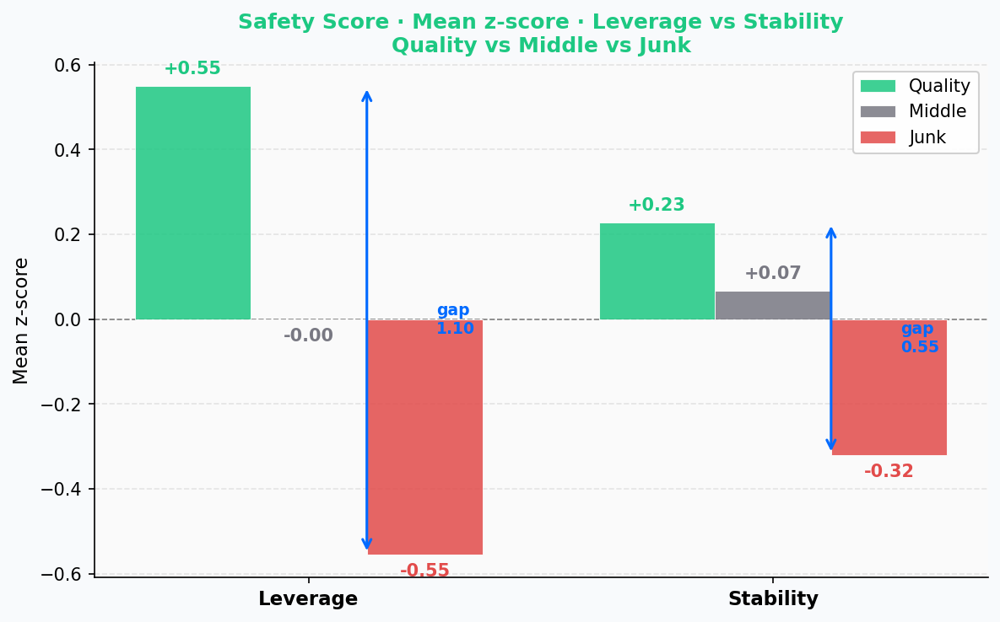
</p>
<p align="center">
  <b>Figure 4: </b>ค่าเฉลี่ย z-score ของตัวชี้วัดด้าน Safety (Leverage และ Stability) สำหรับกลุ่ม Quality, Middle และ Junk*
</p>

<!-- 
*Figure 4: ค่าเฉลี่ย z-score ของตัวชี้วัดด้าน Safety (Leverage และ Stability) สำหรับกลุ่ม Quality, Middle และ Junk* -->

Quality portfolio มีลักษณะความเสี่ยงที่ดีกว่าอย่างมีนัยสำคัญ โดยมีภาระหนี้ต่ำกว่า (Leverage ที่ปรับทิศทางแล้ว) และความผันผวนของกำไรต่ำกว่า (Stability) เมื่อเทียบกับ Junk ซึ่งสะท้อนถึงความแข็งแกร่งของโครงสร้างทางการเงิน นอกจากนี้ความแตกต่างที่สูงในมิติ Leverage บ่งชี้ว่าการควบคุมภาระหนี้เป็นปัจจัยสำคัญในการแยกหุ้นคุณภาพในโมเดลนี้

<p align="center">
  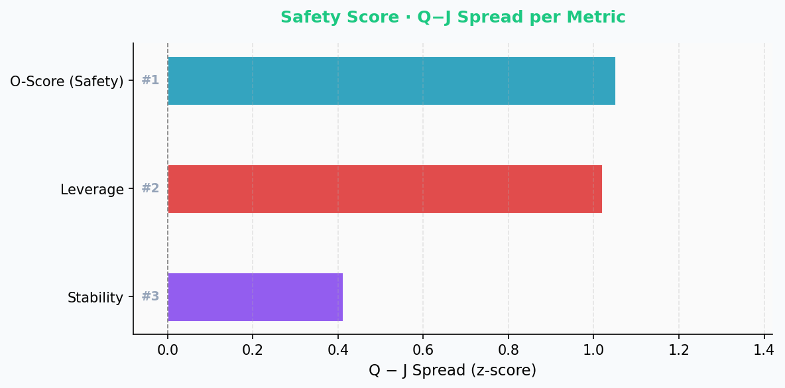
</p>
<p align="center">
  <b>Figure 5: </b>ค่า Q–J Spread (Quality − Junk) ของตัวชี้วัดด้าน Safety (Leverage และ Stability)
</p>

<!-- 
*Figure 5: ค่า Q–J Spread (Quality − Junk) ของตัวชี้วัดด้าน Safety (Leverage และ Stability)* -->

Leverage เป็นตัวแปรหลักในการแยกหุ้นคุณภาพ โดยมีค่า Q–J Spread สูงที่สุดอย่างมีนัยสำคัญ สะท้อนว่าบริษัทที่มีภาระหนี้ต่ำมีแนวโน้มถูกจัดอยู่ในกลุ่ม Quality มากกว่า ขณะที่ Stability แม้มีบทบาทรองลงมา แต่ยังช่วยเสริมความสามารถของโมเดลในการระบุบริษัทที่มีผลประกอบการสม่ำเสมอ ซึ่งทั้งสองปัจจัยร่วมกันสะท้อนมิติด้านความเสี่ยงของ Quality factor

<p align="center">
  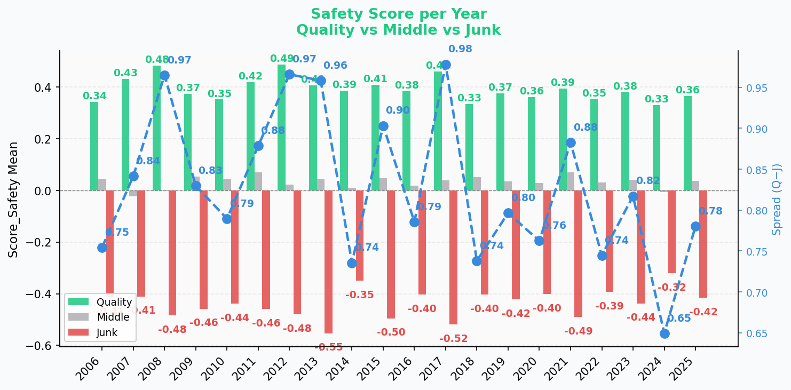
</p>
<p align="center">
  <b>Figure 6: </b>ค่าเฉลี่ย Safety score ของกลุ่ม Quality, Middle และ Junk ในแต่ละปี พร้อม Q–J Spread
</p>

<!-- 
*Figure 6: ค่าเฉลี่ย Safety score ของกลุ่ม Quality, Middle และ Junk ในแต่ละปี พร้อม Q–J Spread* -->

Safety factor มีความสม่ำเสมอในเชิงสัญญาณ โดย Q–J Spread ยังคงเป็นบวกในทุกปี อย่างไรก็ตาม ระดับของ spread มีแนวโน้มอ่อนตัวลงในช่วงหลัง และมีความผันผวนในแต่ละปี สะท้อนว่าแม้ปัจจัยด้านความเสี่ยงยังสามารถแยกหุ้นได้อย่างต่อเนื่อง แต่ความแรงของสัญญาณไม่ได้คงที่ในทุกช่วงเวลา

### Growth (การเติบโต)

นอกจากการทำกำไรได้ดีและมีความปลอดภัยแล้ว บริษัทที่มีคุณภาพจะต้องแสดงให้เห็นถึง "การเติบโต" ของผลประกอบการอย่างต่อเนื่อง คะแนนส่วนนี้จึงถูกนำมาใช้เพื่อแยกแยะระหว่างบริษัทที่กำลังขยายตัว (Expanding) ออกจากบริษัทที่เริ่มอิ่มตัวหรืออยู่ในภาวะถดถอย

**วิธีการคำนวณ:** คำนวณจากการเปลี่ยนแปลง (Delta หรือ Δ) ของอัตราส่วนในกลุ่ม Profitability โดยเปรียบเทียบปีปัจจุบันกับข้อมูลย้อนหลัง 5 ปี (หรือตามระยะเวลาที่กำหนด) จากนั้นนำมาทำ Z-Score:

$$\text{Growth} = z\left(\frac{1}{5}(z_{\Delta \text{GPOA}} + z_{\Delta \text{ROE}} + z_{\Delta \text{ROA}} + z_{\Delta \text{CFOA}} + z_{\Delta \text{GMAR}})\right)$$


สูตรการคำนวณ:

$$\Delta\text{GPOA} = \frac{\text{GPOA}_{t} - \text{GPOA}_{t-5}}{\text{GPOA}_{t-5}}$$

$$\Delta\text{ROE} = \frac{\text{ROE}_{t} - \text{ROE}_{t-5}}{\text{ROE}_{t-5}}$$

$$\Delta\text{ROA} = \frac{\text{ROA}_{t} - \text{ROA}_{t-5}}{\text{ROA}_{t-5}}$$

$$\Delta\text{CFOA} = \frac{\text{CFOA}_{t} - \text{CFOA}_{t-5}}{\text{CFOA}_{t-5}}$$

$$\Delta\text{GMAR} = \frac{\text{GMAR}_{t} - \text{GMAR}_{t-5}}{\text{GMAR}_{t-5}}$$

| ตัวชี้วัด | ความหมาย |
|----------|---------|
| **ΔGPOA** | การเติบโตของ Gross Profit Margin โดยวัดจากการเปลี่ยนแปลงใน 5 ปี |
| **ΔROE** | การเติบโตของผลตอบแทนทุน แสดงให้เห็นว่าเจ้าของเกิดประโยชน์มากขึ้นหรือน้อยลง |
| **ΔROA** | การเติบโตของผลตอบแทนสินทรัพย์ แสดงว่าบริษัทใช้สินทรัพย์อย่างมีประสิทธิภาพมากขึ้นหรือไม่ |
| **ΔCFOA** | การเติบโตของกระแสเงินสด แสดงว่าบริษัทสร้างเงินสดจริงได้มากขึ้นหรือน้อยลง ซึ่งสำคัญมากสำหรับความยั่งยืน |
| **ΔGMAR** | การเติบโตของกำไรขั้นต้น แสดงว่าบริษัทสามารถรักษากำไรขั้นต้นไว้หรือเพิ่มขึ้น |

<p align="center">
  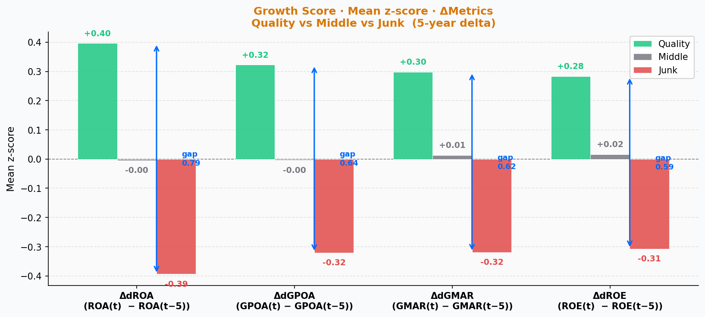
</p>
<p align="center">
  <b>Figure 7: </b>ค่าเฉลี่ย z-score ของตัวชี้วัดด้าน Growth (ΔROA, ΔGPOA, ΔGMAR และ ΔROE; 5-year change) สำหรับกลุ่ม Quality, Middle และ Junk
</p>

<!-- 
*Figure 7: ค่าเฉลี่ย z-score ของตัวชี้วัดด้าน Growth (ΔROA, ΔGPOA, ΔGMAR และ ΔROE; 5-year change) สำหรับกลุ่ม Quality, Middle และ Junk* -->

Quality portfolio ไม่เพียงมีผลประกอบการที่ดีในปัจจุบัน แต่ยังมีแนวโน้มการเติบโตที่แข็งแกร่งกว่าในระยะยาว โดยตัวชี้วัดการเปลี่ยนแปลง เช่น ΔROA และ ΔGPOA แสดงให้เห็นความแตกต่างที่ชัดเจนระหว่าง Quality และ Junk ขณะที่ค่าเฉลี่ยของ Middle อยู่ใกล้ศูนย์ สะท้อนว่า Growth มีบทบาทเป็นปัจจัยเสริม (secondary factor) มากกว่าตัวขับเคลื่อนหลัก เมื่อเทียบกับ Profitability และ Safety

<p align="center">
  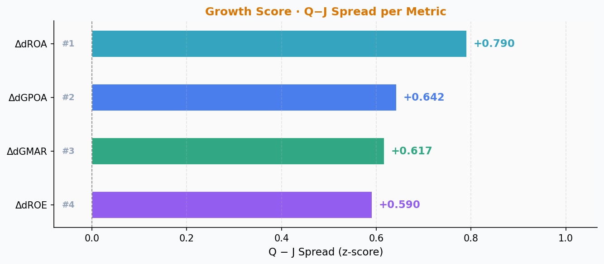
</p>
<p align="center">
  <b>Figure 8: </b>ค่า Q–J Spread (Quality − Junk) ของตัวชี้วัดด้าน Growth แต่ละตัว (ΔROA, ΔGPOA, ΔGMAR และ ΔROE)
</p>

<!-- 
*Figure 8: ค่า Q–J Spread (Quality − Junk) ของตัวชี้วัดด้าน Growth แต่ละตัว (ΔROA, ΔGPOA, ΔGMAR และ ΔROE)* -->

ΔROA เป็นตัวแปรที่มีพลังในการแยกหุ้นคุณภาพสูงที่สุดในกลุ่ม Growth สะท้อนถึงความสำคัญของการปรับตัวดีขึ้นของผลตอบแทนต่อสินทรัพย์ ขณะที่ตัวชี้วัดอื่น เช่น ΔGPOA และ ΔGMAR ยังมีบทบาทสนับสนุนในการจับการเติบโตของประสิทธิภาพการดำเนินงาน แม้ว่าโดยรวมแล้วมิติด้าน Growth จะมีอิทธิพลรองลงมาจาก Profitability และ Safety แต่ยังช่วยเสริมความสมบูรณ์ของโมเดลในการประเมินคุณภาพหุ้นในระยะยาว

<p align="center">
  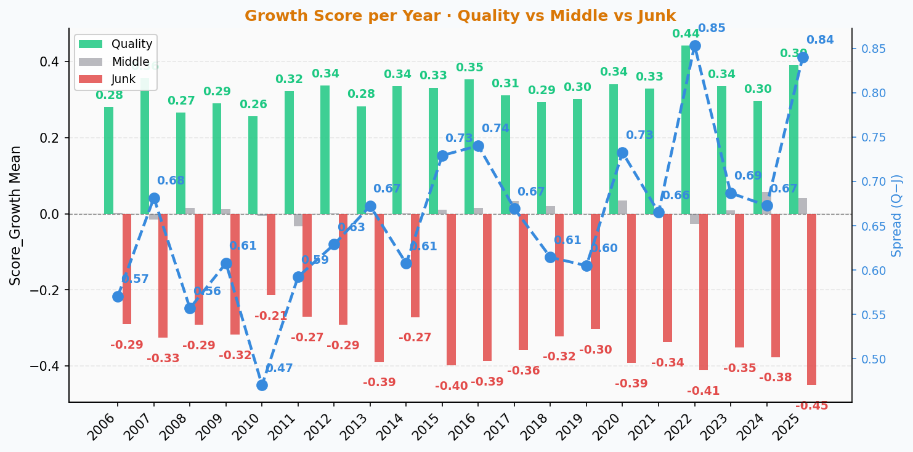
</p>
<p align="center">
  <b>Figure 9: </b>ค่าเฉลี่ย Growth score ของกลุ่ม Quality, Middle และ Junk ในแต่ละปี พร้อม Q–J Spread
</p>

<!-- 
*Figure 9: ค่าเฉลี่ย Growth score ของกลุ่ม Quality, Middle และ Junk ในแต่ละปี พร้อม Q–J Spread* -->

Growth factor แสดงให้เห็นถึงความสามารถในการแยกหุ้นอย่างต่อเนื่อง โดย Quality portfolio มีคะแนนสูงกว่า Junk ในทุกปี และ Q–J Spread ยังคงเป็นบวกตลอดช่วงเวลา อย่างไรก็ตาม ระดับของ spread มีความผันผวนและแสดงแนวโน้มเพิ่มขึ้นในช่วงหลัง โดยเฉพาะหลังปี 2020 ซึ่งสะท้อนถึงการเสริมความแข็งแกร่งของสัญญาณด้านการเติบโตในบางช่วงของวัฏจักรตลาด

### Composite Quality Score

เพื่อให้ได้ผลสรุปของคุณภาพหุ้นในภาพรวม ข้อมูลจากทั้ง 3 เสาหลักจะถูกนำมารวมผ่านกระบวนการดังนี้:

1. **Standardization:** ตัวชี้วัดย่อยทั้งหมดจะถูกแปลงเป็นค่ามาตรฐาน (Z-Score) เพื่อปรับหน่วยวัดที่แตกต่างกันให้สามารถนำมาคำนวณร่วมกันได้ โดยทิศทางของคะแนนจะถูกปรับให้หุ้นที่มีคุณภาพสูง (ความเสี่ยงต่ำ, กำไรสูง, เติบโตสูง) ได้รับคะแนนที่เป็นบวกมากที่สุด
   
$$z(x) = \frac{r_x - \mu_r}{\sigma_r}$$


2. **Aggregation:** คำนวณหาค่าเฉลี่ยของคะแนนในแต่ละมิติ (Profit Score, Safety Score, Growth Score) จากนั้นนำคะแนนทั้ง 3 ด้านมาหาค่าเฉลี่ยรวมอีกครั้งเพื่อให้ได้คะแนนคุณภาพสุทธิ หรือ Composite Quality Score:

$$\text{Quality Score}_{i,t} = z\left(\frac{1}{3}(\text{Profitability}_{i,t} + \text{Safety}_{i,t} + \text{Growth}_{i,t})\right)$$

โดยที่:
- $\text{Profitability}_{i,t}$ = คะแนน Profitability ของหุ้น $i$ ในช่วงเวลา $t$
- $\text{Safety}_{i,t}$ = คะแนน Safety ของหุ้น $i$ ในช่วงเวลา $t$
- $\text{Growth}_{i,t}$ = คะแนน Growth ของหุ้น $i$ ในช่วงเวลา $t$
- $z(\cdot)$ = ฟังก์ชัน standardization (z-score transformation) ที่นำเสนอด้านบน

3. **Ranking & Portfolio Construction:** หุ้นทั้งหมดในดัชนี S&P 500 จะถูกจัดลำดับตามคะแนนรวมที่ได้ โดยหุ้นที่มีคะแนนสูงสุด 30% แรกจะถูกคัดเลือกเข้าสู่พอร์ตโฟลิโอหุ้นคุณภาพ (Quality Portfolio) และหุ้นที่มีคะแนนต่ำสุด 30% หลังจะถูกจัดเป็นกลุ่มหุ้นด้อยค่า (Junk Portfolio)

$$\text{Percentile}_{i,t} = \frac{\text{Rank}(\text{QMJ Score}_i) - 1}{N - 1} \times 100\%$$

โดยที่:
- $N$ = จำนวนหลักทรัพย์ทั้งหมดในช่วงเวลา $t$
- Quality Portfolio = สต็อกที่ Percentile ≥ 70% (Top 30%)
- Junk Portfolio = สต็อกที่ Percentile ≤ 30% (Bottom 30%)


## QMJ Score Distribution & Portfolio Assignment
### QMJ Score Analysis 

<p align="center">
  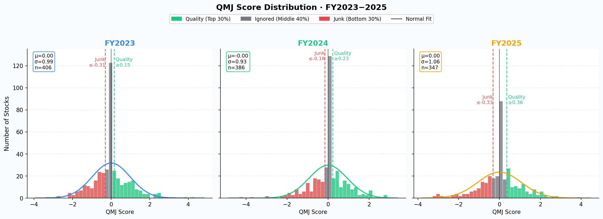
</p>
<p align="center">
  <b>Figure 10: </b>การกระจายตัวของ QMJ Score ในช่วง FY2023–2025 พร้อมเส้น normal fit และจุดตัดสำหรับการแบ่งกลุ่ม Quality (Top 30%) และ Junk (Bottom 30%)
</p>

<!-- 
*Figure 10: การกระจายตัวของ QMJ Score ในช่วง FY2023–2025 พร้อมเส้น normal fit และจุดตัดสำหรับการแบ่งกลุ่ม Quality (Top 30%) และ Junk (Bottom 30%)* -->

การกระจายตัวของ QMJ Score ในช่วง FY2023–2025 แสดงให้เห็นว่าคะแนนมีลักษณะใกล้เคียงการแจกแจงแบบปกติ (normal distribution) โดยมีการแบ่งกลุ่ม Quality (Top 30%) และ Junk (Bottom 30%) ในทุกปีอย่างสม่ำเสมอ โดย threshold ของ Quality อยู่ในช่วงค่าบวก และ Junk อยู่ในช่วงค่าลบ

<p align="center">
  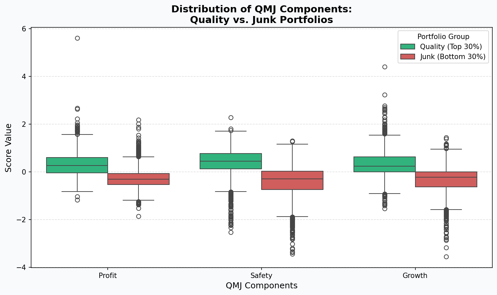
</p>
<p align="center">
  <b>Figure 11: </b>การกระจายตัวของคะแนน QMJ components (Profit, Safety, Growth) สำหรับกลุ่ม Quality (Top 30%) และ Junk (Bottom 30%) แสดงด้วย boxplot และ outliers
</p>

<!-- 
*Figure 11: การกระจายตัวของคะแนน QMJ components (Profit, Safety, Growth) สำหรับกลุ่ม Quality (Top 30%) และ Junk (Bottom 30%) แสดงด้วย boxplot และ outliers* -->

การกระจายตัวของคะแนน QMJ components (Profit, Safety, Growth) แสดงให้เห็นว่า Quality มีค่าโดยรวมอยู่ฝั่งบวก ขณะที่ Junk อยู่ฝั่งลบ และสามารถแยกกลุ่มได้ในทุกมิติ โดยเฉพาะด้าน Safety ที่มีความแตกต่างชัดเจนที่สุด อย่างไรก็ตามยังมีบางช่วงที่ค่าของทั้งสองกลุ่มทับซ้อนกันใกล้ศูนย์ แสดงว่าการแยกกลุ่มไม่ได้สมบูรณ์ในทุกกรณี นอกจากนี้ทั้ง Quality และ Junk ต่างก็มีลักษณะหาง (tails) และ outliers ซึ่งเป็นเรื่องปกติของข้อมูลการเงิน ซึ่งเกิดจากความแตกต่างของธุรกิจและเหตุการณ์พิเศษบางช่วง และมีระดับใกล้เคียงกันในทั้งสองกลุ่ม สะท้อนว่าความเสี่ยงของค่าที่เบี่ยงเบนอย่างรุนแรงสามารถเกิดขึ้นได้ในทั้งสองฝั่ง

<p align="center">
  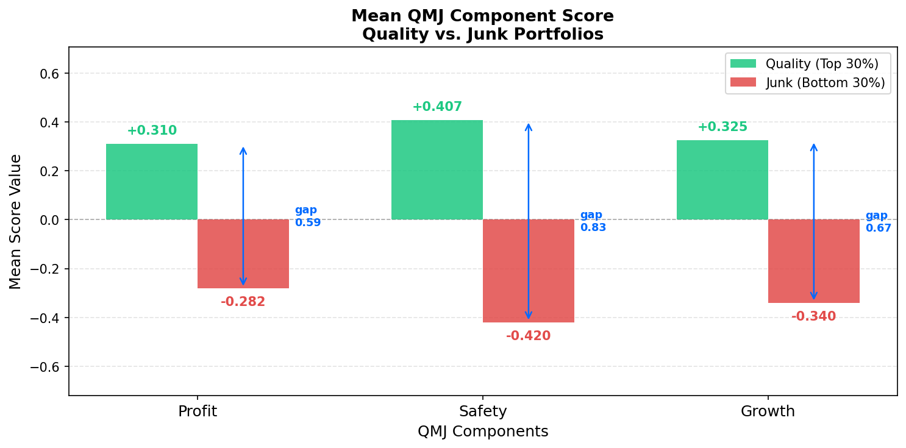
</p>
<p align="center">
  <b>Figure 12: </b>ค่าเฉลี่ยของคะแนน QMJ components (Profit, Safety, Growth) สำหรับกลุ่ม Quality (Top 30%) และ Junk (Bottom 30%) พร้อมค่า gap ระหว่างสองกลุ่ม
</p>

<!-- 
*Figure 12: ค่าเฉลี่ยของคะแนน QMJ components (Profit, Safety, Growth) สำหรับกลุ่ม Quality (Top 30%) และ Junk (Bottom 30%) พร้อมค่า gap ระหว่างสองกลุ่ม* -->

ค่าเฉลี่ยของคะแนน QMJ components ระหว่าง Quality และ Junk แสดงให้เห็นว่ากลุ่ม Quality มีค่าคะแนนสูงกว่ากลุ่ม Junk ในทุกมิติ โดย Safety มีความแตกต่างของค่าเฉลี่ยมากที่สุด รองลงมาคือ Growth และ Profit ซึ่งสะท้อนถึงความสามารถของแต่ละปัจจัยในการแยกกลุ่มหุ้นได้อย่างชัดเจน

<p align="center">
  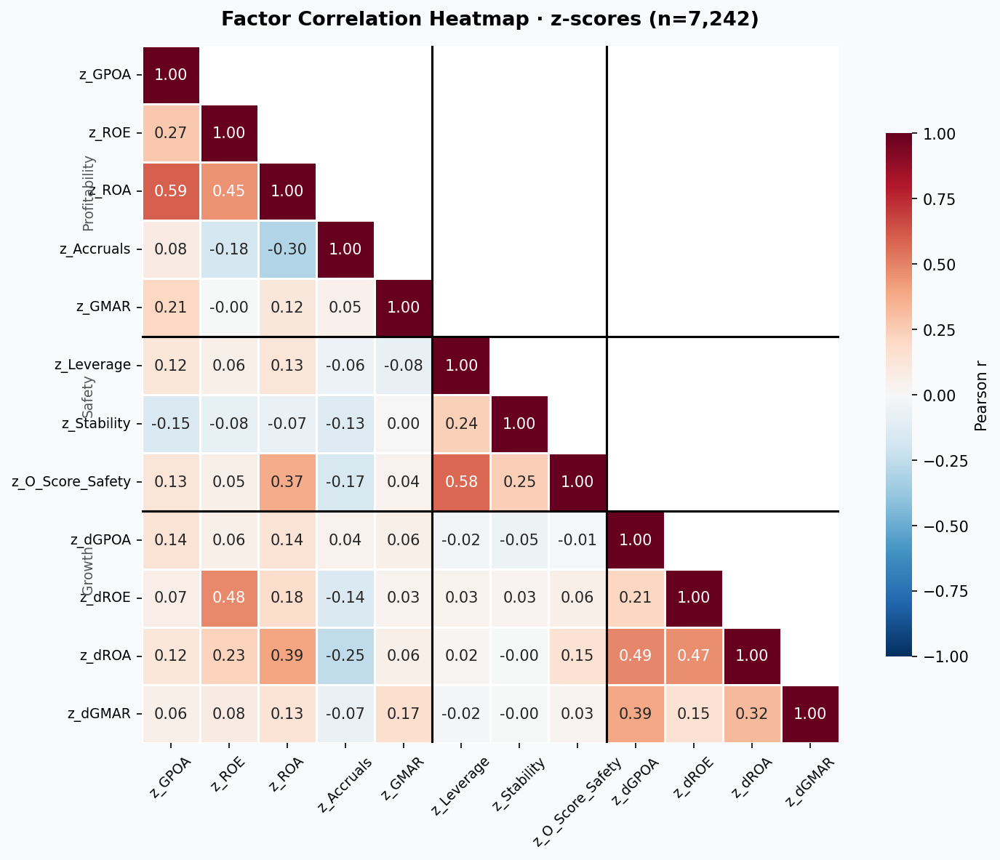
</p>
<p align="center">
  <b>Figure 13: </b>Correlation heatmap ของ QMJ factors (z-scores) แสดงค่าสหสัมพันธ์ระหว่างตัวชี้วัดในแต่ละมิติ (Profitability, Safety และ Growth)
</p>

<!-- 
*Figure 13: Correlation heatmap ของ QMJ factors (z-scores) แสดงค่าสหสัมพันธ์ระหว่างตัวชี้วัดในแต่ละมิติ (Profitability, Safety และ Growth)* -->

Correlation heatmap ของ QMJ factors (z-scores) แสดงให้เห็นว่าความสัมพันธ์ระหว่างตัวชี้วัดส่วนใหญ่อยู่ในระดับต่ำถึงปานกลาง แม้ว่าจะมีบางคู่ที่มีความสัมพันธ์ค่อนข้างสูงในบางมิติ แต่โดยรวมแล้ว สะท้อนว่าแต่ละ factor ให้ข้อมูลที่แตกต่างกัน (diversified signals) และไม่ซ้ำซ้อนกันมากนัก ซึ่งช่วยเพิ่มประสิทธิภาพของ composite model ในการจับสัญญาณคุณภาพหุ้นได้ดียิ่งขึ้น

<p align="center">
  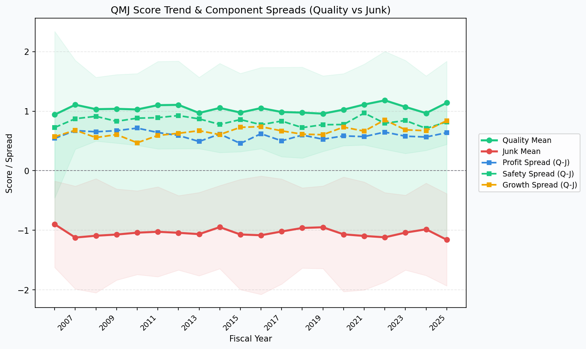
</p>
<p align="center">
  <b>Figure 14: </b>แนวโน้มค่าเฉลี่ย QMJ Score ของกลุ่ม Quality และ Junk พร้อมค่า Q–J Spreadของแต่ละ component (Profit, Safety และ Growth) ในแต่ละปี
</p>

<!-- 
*Figure 14: แนวโน้มค่าเฉลี่ย QMJ Score ของกลุ่ม Quality และ Junk พร้อมค่า Q–J Spreadของแต่ละ component (Profit, Safety และ Growth) ในแต่ละปี* -->

QMJ Score และ component spreads แสดงแนวโน้มที่สม่ำเสมอ โดย Quality มีค่าคะแนนสูงกว่า Junk ในทุกช่วงเวลา และค่า Q–J Spread ของแต่ละ component ยังคงเป็นบวกอย่างต่อเนื่อง แม้จะมีความผันผวนในบางปี ซึ่งสะท้อนถึงความสามารถของโมเดลในการแยกหุ้นคุณภาพได้อย่างต่อเนื่องตลอดช่วงเวลา

## Stock-Level Quality

<p align="center">
  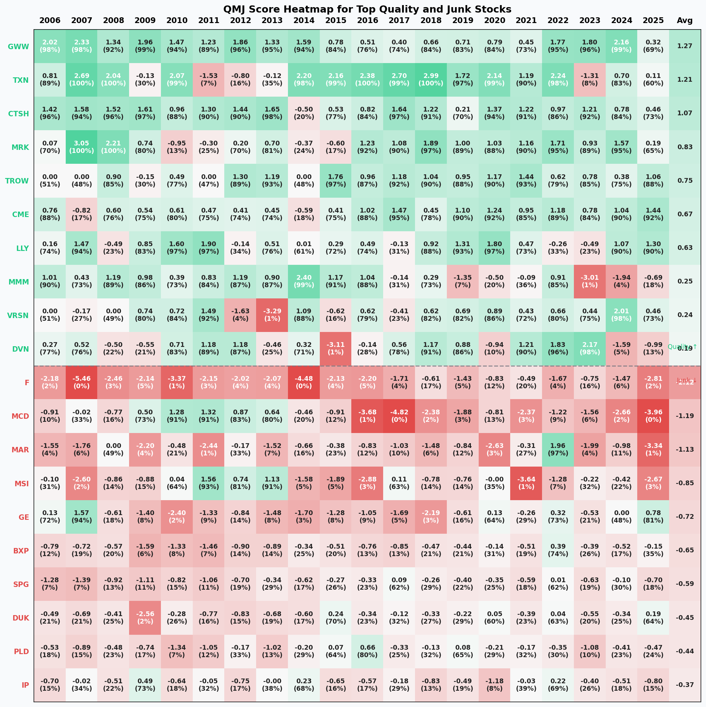
</p>
<p align="center">
  <b>Figure 15: </b>Heatmap ของ QMJ Score สำหรับหุ้นที่อยู่ในกลุ่ม Quality และ Junk บ่อยในช่วงปี 2006–2025 โดยแสดงค่า QMJ Score และ percentile rank ในแต่ละปี พร้อมค่าเฉลี่ย (Avg) ตลอดช่วงเวลา
</p>

<!-- 
*Figure 15: Heatmap ของ QMJ Score สำหรับหุ้นที่อยู่ในกลุ่ม Quality และ Junk บ่อยในช่วงปี 2006–2025 โดยแสดงค่า QMJ Score และ percentile rank ในแต่ละปี พร้อมค่าเฉลี่ย (Avg) ตลอดช่วงเวลา* -->

Heatmap ของ QMJ Score สำหรับหุ้นที่อยู่ในกลุ่ม Quality และ Junk บ่อยในช่วงปี 2006–2025 แสดงให้เห็นว่าหุ้นในกลุ่ม Quality โดยรวมมีค่า QMJ Score เป็นบวกและอยู่ใน percentile ที่สูง ขณะที่หุ้นในกลุ่ม Junk มีค่าเป็นลบและอยู่ใน percentile ที่ต่ำในหลายช่วงเวลา แม้จะมีบางปีที่ค่าของแต่ละหุ้นเปลี่ยนแปลงไปจากแนวโน้มเดิม แต่ค่าเฉลี่ย (Avg) ยังคงสะท้อนความแตกต่างระหว่างสองกลุ่มได้อย่างชัดเจน

## Sector-Level Quality Dynamics
<p align="center">
  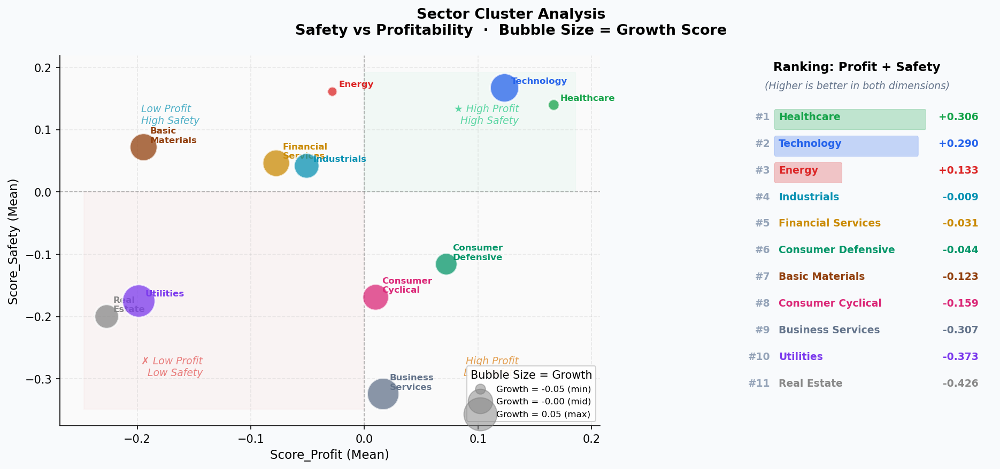
</p>
<p align="center">
  <b>Figure 16: </b> การกระจายตัวของแต่ละ sector บนแกน Profitability และ Safety โดยขนาดของจุดแสดงค่า Growth score และมีการจัดอันดับตามค่าเฉลี่ย Profit + Safety
</p>

<!-- 
*Figure 16: การกระจายตัวของแต่ละ sector บนแกน Profitability และ Safety โดยขนาดของจุดแสดงค่า Growth score และมีการจัดอันดับตามค่าเฉลี่ย Profit + Safety* -->

การกระจายตัวของแต่ละ sector แสดงให้เห็นว่ามีความแตกต่างในด้าน Profitability และ Safety โดย Technology อยู่ในกลุ่มที่มีค่าทั้งสองมิติสูง ขณะที่ Healthcare มีค่าบวกในทั้งสองด้านเช่นกัน ส่วน Utilities และ Real Estate อยู่ในฝั่งที่มีค่าต่ำในทั้งสองมิติ นอกจากนี้บาง sector เช่น Energy และ Financial Services มีลักษณะค่าที่ไม่สมดุลระหว่างสองแกน สะท้อนถึงความแตกต่างของโครงสร้างและลักษณะธุรกิจในแต่ละอุตสาหกรรม

<p align="center">
  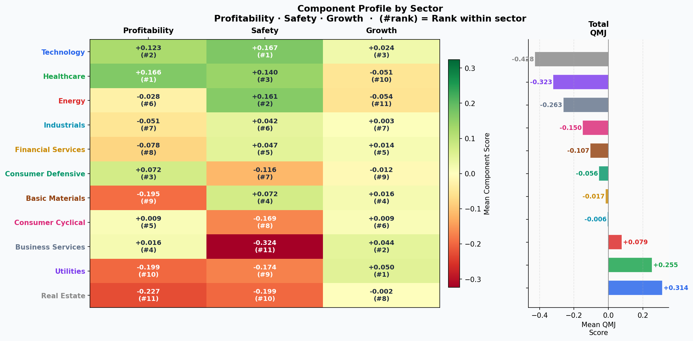
</p>
<p align="center">
  <b>Figure 17: </b> ค่าเฉลี่ยของ Profitability, Safety และ Growth ในแต่ละ sector พร้อมอันดับภายในแต่ละมิติ และค่า QMJ รวม (Total QMJ)
</p>

<!-- 
*Figure 17: ค่าเฉลี่ยของ Profitability, Safety และ Growth ในแต่ละ sector พร้อมอันดับภายในแต่ละมิติ และค่า QMJ รวม (Total QMJ)* -->

แต่ละ sector มีองค์ประกอบของคะแนนที่แตกต่างกัน โดย Technology มีค่าค่อนข้างสูงทั้งด้าน Profitability และ Safety ขณะที่บาง sector เช่น Energy และ Financial Services มีคะแนน Safety สูงแต่ Profitability ต่ำ นอกจากนี้ยังพบว่าแต่ละ sector มีจุดเด่นในมิติที่ต่างกัน เช่น Utilities ที่มี Growth สูงแต่ Profit ต่ำ หรือ Healthcare ที่มี Profit สูงแต่ Growth ต่ำ ซึ่งแสดงให้เห็นว่าคุณภาพของแต่ละอุตสาหกรรมเกิดจากการผสมผสานของหลายปัจจัย ไม่ได้ขึ้นอยู่กับมิติใดมิติหนึ่งเพียงอย่างเดียว

<p align="center">
  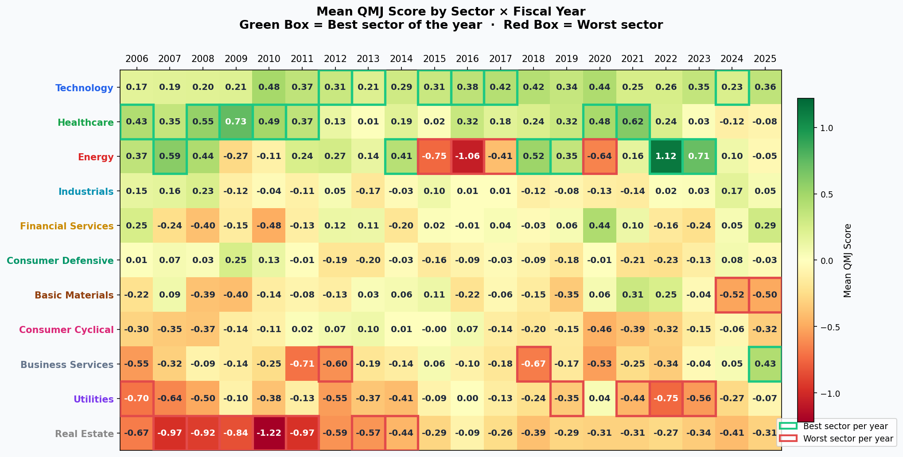
</p>
<p align="center">
  <b>Figure 18: </b> ค่าเฉลี่ย QMJ Score ของแต่ละ sector ในแต่ละปี โดยกล่องสีเขียวแสดง sector ที่มีค่าสูงสุด และสีแดงแสดง sector ที่มีค่าต่ำสุดในแต่ละปี
</p>

<!-- 
*Figure 18: ค่าเฉลี่ย QMJ Score ของแต่ละ sector ในแต่ละปี โดยกล่องสีเขียวแสดง sector ที่มีค่าสูงสุด และสีแดงแสดง sector ที่มีค่าต่ำสุดในแต่ละปี* -->

ผลลัพธ์แสดงให้เห็นว่าคะแนน QMJ ของแต่ละ sector มีการเปลี่ยนแปลงตามช่วงเวลา โดยมีการสลับกันเป็น sector ที่มีคะแนนสูงสุดและต่ำสุดในแต่ละปี ซึ่งสะท้อนถึงความแตกต่างของผลการดำเนินงานในแต่ละช่วง โดยบาง sector เช่น Energy มีความผันผวนสูง โดยมีทั้งช่วงที่มีคะแนนสูงและต่ำอย่างชัดเจน ขณะที่ Technology และ Healthcare โดยรวมมีค่าคะแนนอยู่ในระดับบวกในหลายช่วงเวลา แม้จะมีบางปีที่ค่าลดลง

<p align="center">
  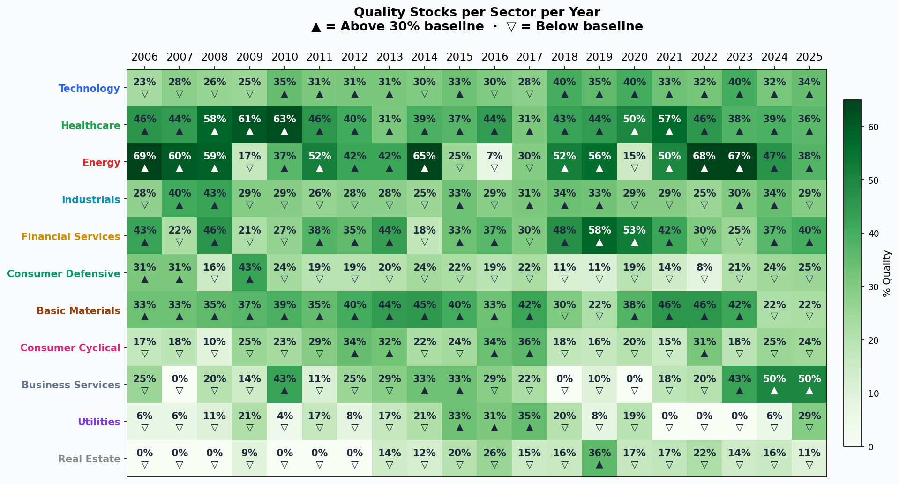
</p>
<p align="center">
  <b>Figure 19: </b> สัดส่วนของหุ้นที่อยู่ในกลุ่ม Quality (Top 30%) ในแต่ละ sector ต่อปี โดยสัญลักษณ์ ▲ แสดงค่าที่สูงกว่า baseline (30%) และ ▽ แสดงค่าที่ต่ำกว่า baseline
</p>

<!-- 
*Figure 19: สัดส่วนของหุ้นที่อยู่ในกลุ่ม Quality (Top 30%) ในแต่ละ sector ต่อปี โดยสัญลักษณ์ ▲ แสดงค่าที่สูงกว่า baseline (30%) และ ▽ แสดงค่าที่ต่ำกว่า baseline* -->

สัดส่วนของหุ้นที่อยู่ในกลุ่ม Quality แตกต่างกันในแต่ละ sector และมีการเปลี่ยนแปลงตามช่วงเวลา โดย Technology และ Healthcare มีสัดส่วนหุ้นคุณภาพสูงในหลายปี ขณะที่บาง sector เช่น Financial Services และ Energy มีความผันผวนสูง โดยมีทั้งช่วงที่สัดส่วนสูงและต่ำกว่าค่า baseline อย่างชัดเจน นอกจากนี้ sector อย่าง Utilities และ Real Estate มักมีสัดส่วนต่ำกว่า baseline ในหลายช่วงเวลา ซึ่งสะท้อนถึงความแตกต่างของลักษณะคุณภาพระหว่างอุตสาหกรรม

<p align="center">
  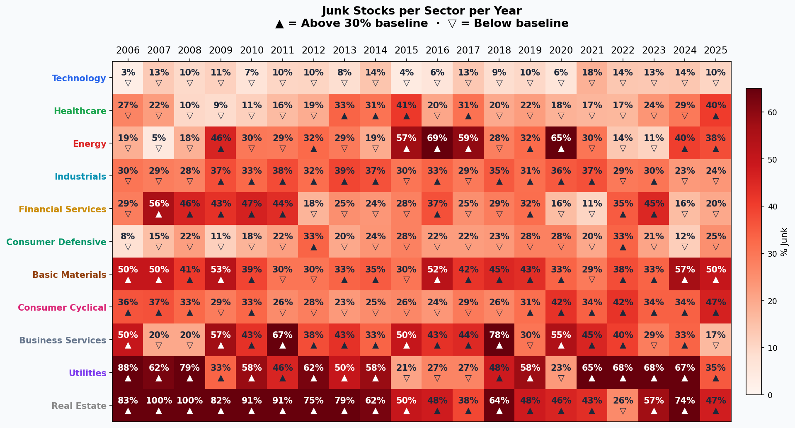
</p>
<p align="center">
  <b>Figure 20: </b> สัดส่วนของหุ้นที่อยู่ในกลุ่ม Junk (Bottom 30%) ในแต่ละ sector ต่อปี โดยสัญลักษณ์ ▲ แสดงค่าที่สูงกว่า baseline (30%) และ ▽ แสดงค่าที่ต่ำกว่า baseline
</p>

<!-- 
*Figure 20: สัดส่วนของหุ้นที่อยู่ในกลุ่ม Junk (Bottom 30%) ในแต่ละ sector ต่อปี โดยสัญลักษณ์ ▲ แสดงค่าที่สูงกว่า baseline (30%) และ ▽ แสดงค่าที่ต่ำกว่า baseline* -->

สัดส่วนของหุ้นที่อยู่ในกลุ่ม Junk แตกต่างกันในแต่ละ sector และมีการเปลี่ยนแปลงตามช่วงเวลา โดย Utilities และ Real Estate มีสัดส่วนหุ้น Junk อยู่ในระดับสูงในหลายปี ขณะที่บาง sector เช่น Energy และ Financial Services มีความผันผวนมาก โดยมีทั้งช่วงที่สัดส่วนสูงและต่ำกว่าค่า baseline อย่างชัดเจน นอกจากนี้ Technology มักมีสัดส่วนหุ้น Junk ต่ำกว่าค่า baseline ในหลายช่วงเวลา ซึ่งสะท้อนถึงความแตกต่างของลักษณะคุณภาพระหว่างอุตสาหกรรม

##  Backtesting Results
###  Portfolio Performance 

<p align="center">
  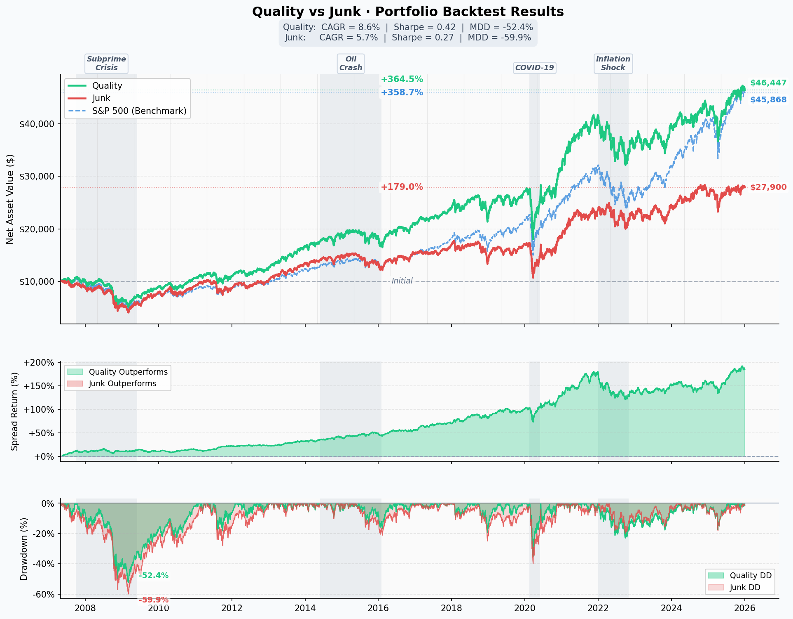
</p>
<p align="center">
  <b>Figure 21: </b> ผลการทดสอบพอร์ต Quality เทียบกับ Junk และ S&P 500 แสดง cumulative equity curve, long–short performance (Quality − Junk) และ drawdown ตลอดช่วงเวลา
</p>

<!-- 
*Figure 21: ผลการทดสอบพอร์ต Quality เทียบกับ Junk และ S&P 500 แสดง cumulative equity curve, long–short performance (Quality − Junk) และ drawdown ตลอดช่วงเวลา* -->

> **Backtest Config**
> - Strategy: `Equal Weight` | Universe: `S&P 500` | Period: `2007–2026`
> - Lookback: `0 days` | Rebalance: `252 days` | Fee: `0.1%`
> - Capital: `$10,000` | Benchmark: `SPY ETF`

ผลลัพธ์จากการ backtest แสดงให้เห็นว่า Quality portfolio ให้ผลตอบแทนสะสมสูงกว่า Junk และใกล้เคียงหรือสูงกว่า S&P 500 ในช่วงเวลาส่วนใหญ่ โดยมีค่า Sharpe ratio ที่สูงกว่าและ drawdown ที่ตื้นกว่าเล็กน้อย ขณะที่กลยุทธ์ long–short (Quality − Junk) มีแนวโน้มเป็นบวกในระยะยาว แม้จะมีช่วงผันผวนหรือการชะลอตัวในบางช่วงเวลา เช่น ในช่วงวิกฤตตลาด อย่างไรก็ตามโดยรวมแล้วผลลัพธ์สะท้อนถึงศักยภาพของ Quality factor ในการสร้างผลตอบแทนที่เหนือกว่าเมื่อพิจารณาในระยะยาว

<p align="center">
  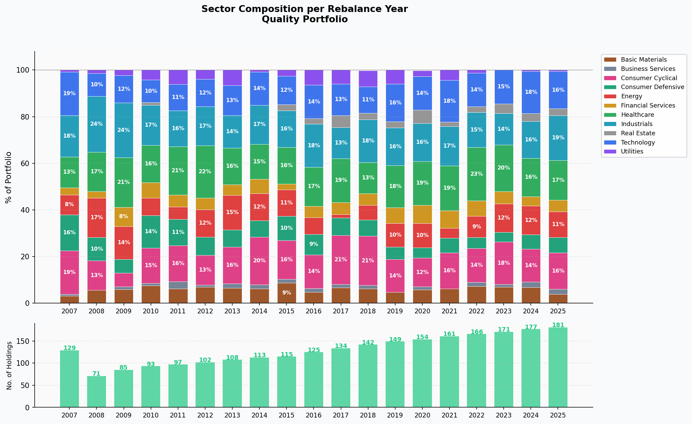
</p>
<p align="center">
  <b>Figure 22: </b> สัดส่วนของแต่ละ sector ในพอร์ต Quality ในแต่ละปี พร้อมจำนวนหุ้นในพอร์ต (number of holdings)
</p>

<!-- 
*Figure 22: สัดส่วนของแต่ละ sector ในพอร์ต Quality ในแต่ละปี พร้อมจำนวนหุ้นในพอร์ต (number of holdings)* -->

<p align="center">
  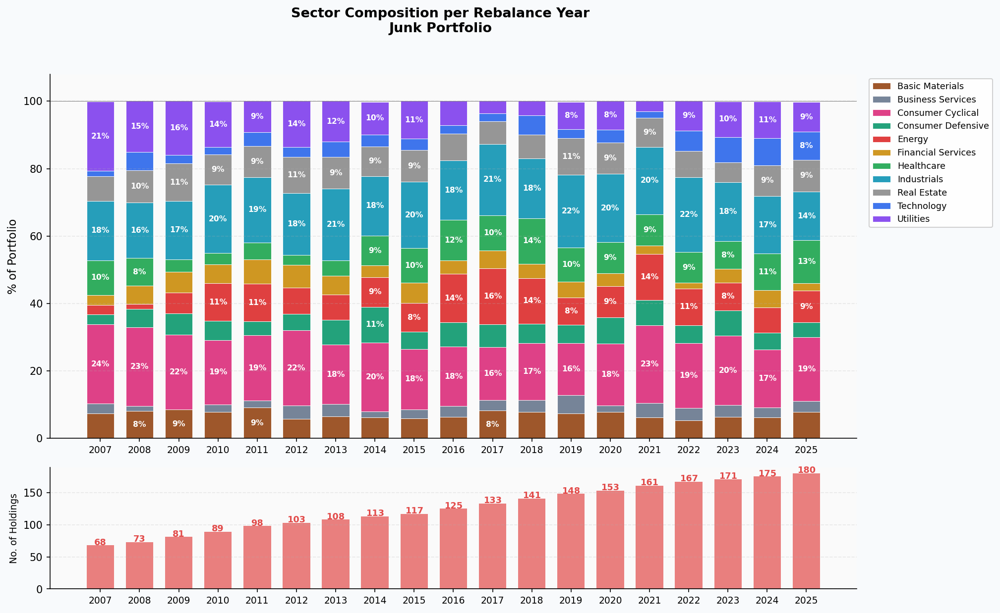
</p>
<p align="center">
  <b>Figure 23: </b> สัดส่วนของแต่ละ sector ในพอร์ต Junk ในแต่ละปี พร้อมจำนวนหุ้นในพอร์ต (number of holdings)
</p>

<!-- 
*Figure 23: สัดส่วนของแต่ละ sector ในพอร์ต Junk ในแต่ละปี พร้อมจำนวนหุ้นในพอร์ต (number of holdings)* -->

ผลลัพธ์แสดงให้เห็นว่าทั้งพอร์ต Quality และ Junk มีการกระจายการลงทุนในหลาย sector โดยไม่มีการกระจุกตัวในอุตสาหกรรมใดอย่างรุนแรง อย่างไรก็ตามพอร์ต Quality มีลักษณะการกระจายที่เปลี่ยนแปลงไปตามเวลา โดย sector ที่มีสัดส่วนสูงสุดไม่ได้คงที่ในแต่ละปี ขณะที่พอร์ต Junk มีรูปแบบที่สม่ำเสมอกว่า โดยมักมี Consumer Cyclical และ Industrials อยู่ในกลุ่มที่มีสัดส่วนสูงในหลายช่วงเวลา ซึ่งสะท้อนว่าความแตกต่างของพอร์ตไม่ได้เกิดจากการกระจุกตัวของ sector แต่เกิดจากโครงสร้างของ sector composition และการคัดเลือกหุ้นภายในแต่ละอุตสาหกรรมเป็นหลัก

<p align="center">
  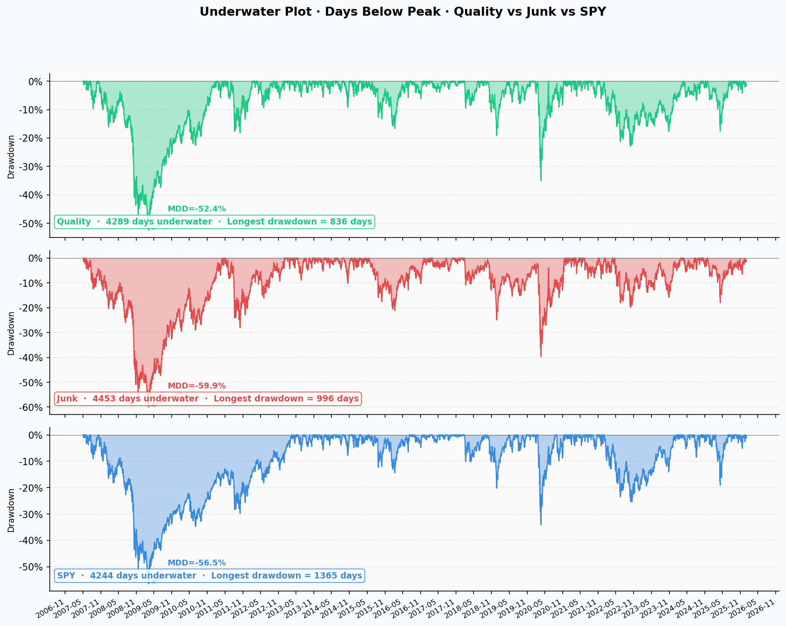
</p>
<p align="center">
  <b>Figure 24: </b> Underwater plot แสดง drawdown ของพอร์ต Quality, Junk และ S&P 500 พร้อมตัวชี้วัด MDD และระยะเวลาอยู่ใต้น้ำ (days underwater) ตลอดช่วงเวลา
</p>

<!-- 
*Figure 24: Underwater plot แสดง drawdown ของพอร์ต Quality, Junk และ S&P 500 พร้อมตัวชี้วัด MDD และระยะเวลาอยู่ใต้น้ำ (days underwater) ตลอดช่วงเวลา* -->

ผลลัพธ์แสดงให้เห็นว่า Quality portfolio มี drawdown ที่ตื้นกว่า Junk และใช้เวลาฟื้นตัวสั้นกว่าในบางช่วงเวลา โดยค่า maximum drawdown (MDD) ต่ำกว่า และระยะเวลาการฟื้นตัวสั้นกว่าเมื่อเทียบกับ Junk ขณะที่ระยะเวลาอยู่ใต้น้ำโดยรวมอยู่ในระดับใกล้เคียงกับตลาด เมื่อพิจารณาในช่วงวิกฤตสำคัญ Quality มักมีการปรับตัวลดลงในระดับที่ใกล้เคียงกับตลาด แต่โดยรวมมีแนวโน้มฟื้นตัวได้เร็วกว่าในบางช่วง ซึ่งสะท้อนถึงลักษณะความเสี่ยงที่แตกต่างกันระหว่างพอร์ต

<p align="center">
  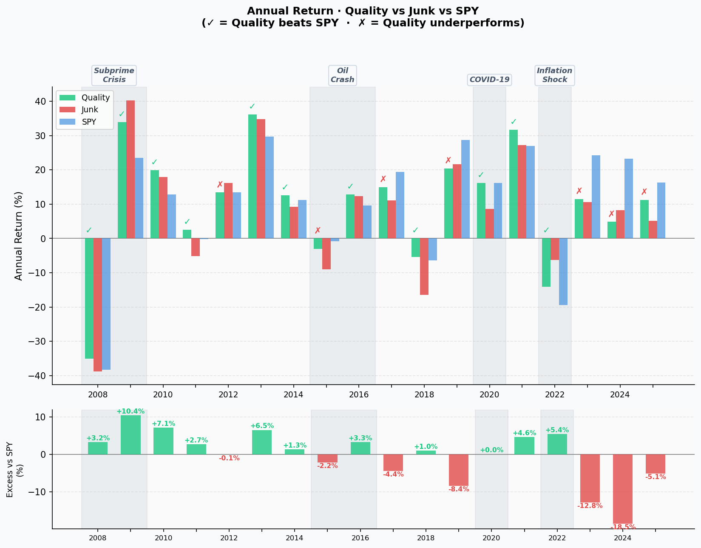
</p>
<p align="center">
  <b>Figure 25: </b> ผลตอบแทนรายปีของพอร์ต Quality, Junk และ S&P 500 พร้อมค่า excess return ของ Quality เทียบกับตลาดในแต่ละปี
</p>

<!-- 
*Figure 25: ผลตอบแทนรายปีของพอร์ต Quality, Junk และ S&P 500 พร้อมค่า excess return ของ Quality เทียบกับตลาดในแต่ละปี* -->

ผลตอบแทนรายปีแสดงให้เห็นว่า Quality portfolio สามารถ outperform ตลาดในหลายปี โดยเฉพาะในบางช่วงหลังภาวะตลาดปรับตัวลดลง อย่างไรก็ตามยังมีบางปีที่ผลตอบแทนต่ำกว่าตลาด ซึ่งสะท้อนถึงความแปรผันของผลลัพธ์ตามสภาวะตลาด โดยรวมแล้วผลลัพธ์ชี้ให้เห็นว่า Quality factor มีแนวโน้มสร้างผลตอบแทนที่ดีในระยะยาว แม้จะมีความผันผวนในระยะสั้น

### Risk Characteristics 
<p align="center">
  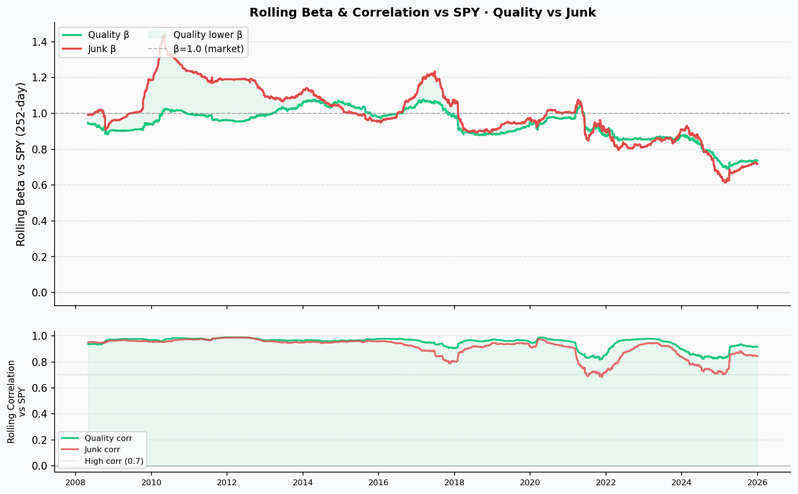
</p>
<p align="center">
  <b>Figure 26: </b> ค่า rolling beta และ correlation ของพอร์ต Quality และ Junk เทียบกับ S&P 500 ในแต่ละช่วงเวลา
</p>

<!-- 
*Figure 26: ค่า rolling beta และ correlation ของพอร์ต Quality และ Junk เทียบกับ S&P 500 ในแต่ละช่วงเวลา* -->

ผลลัพธ์แสดงให้เห็นว่า Quality portfolio มีค่า beta ที่โดยรวมต่ำกว่า Junk ในหลายช่วงเวลา แม้จะมีบางช่วงที่ค่าทั้งสองใกล้เคียงกัน ขณะที่ correlation กับตลาดยังคงอยู่ในระดับสูงสำหรับทั้งสองพอร์ต ซึ่งสะท้อนว่าผลตอบแทนของ Quality ยังคงเคลื่อนไหวไปในทิศทางเดียวกับตลาด โดยไม่ได้เกิดจากการลดการสัมผัสกับตลาดอย่างมีนัยสำคัญ นอกจากนี้ในช่วงหลังพบว่า beta ของทั้งสองพอร์ตมีแนวโน้มลดลง ซึ่งอาจสะท้อนถึงการเปลี่ยนแปลงของสภาวะตลาดในช่วงเวลาดังกล่าว

## Conclusion
การวิเคราะห์ Quality Minus Junk (QMJ) แสดงให้เห็นว่า “คุณภาพของบริษัท” เป็นปัจจัยที่สามารถอธิบายความแตกต่างของผลตอบแทนได้อย่างมีนัยสำคัญ โดย Profitability เป็นตัวขับเคลื่อนหลักของ Quality ขณะที่ Safety ทำหน้าที่ลดความเสี่ยงและเสริมความทนทานของพอร์ต และ Growth ทำหน้าที่เป็นปัจจัยเสริมที่ช่วยยืนยันความต่อเนื่องของคุณภาพในระยะยาว

ผลการทดสอบเชิงประจักษ์ชี้ให้เห็นว่า Quality portfolio สามารถสร้างผลตอบแทนสะสมที่สูงกว่า พร้อมความเสี่ยงที่ต่ำกว่า ทั้งในแง่ของ drawdown และ market sensitivity โดย long-short strategy (Quality − Junk) ให้ spread เป็นบวกอย่างต่อเนื่อง สะท้อนถึงความแข็งแกร่งของ factor ในหลายสภาวะตลาด

แม้จะมีบางช่วงที่ underperform ซึ่งสะท้อนลักษณะ regime dependency ของ factor investing แต่โดยรวม Quality ยังคงเป็นปัจจัยที่มีความสม่ำเสมอ เสถียร และสามารถสร้างผลตอบแทนระยะยาวได้อย่างมีประสิทธิภาพ

โดยสรุป Quality factor ไม่ได้เป็นเพียงภาพสะท้อนของกำไรในปัจจุบัน แต่เป็นการรวมกันของความสามารถในการทำกำไร โครงสร้างทางการเงินที่แข็งแกร่ง และการเติบโตที่ยั่งยืน ซึ่งร่วมกันสร้างสัญญาณการลงทุนที่มีความน่าเชื่อถือในระยะยาว

## References

- Asness, C. S., Frazzini, A., & Pedersen, L. H. (2019). *Quality Minus Junk*. Review of Accounting Studies.